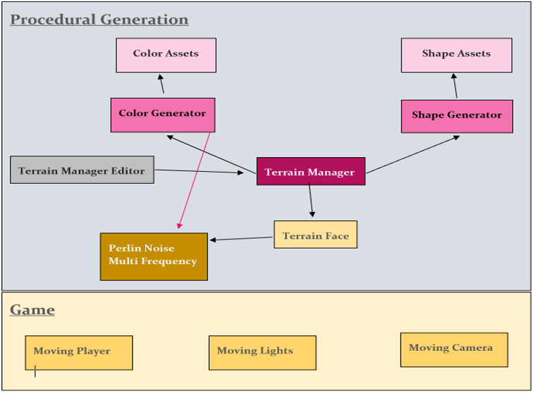
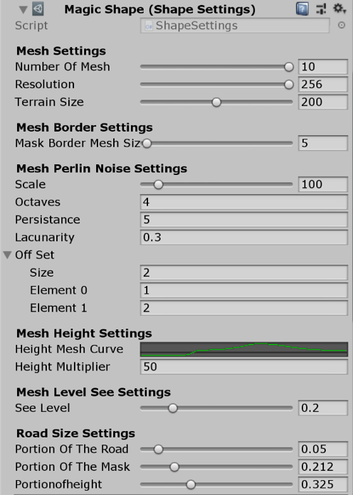
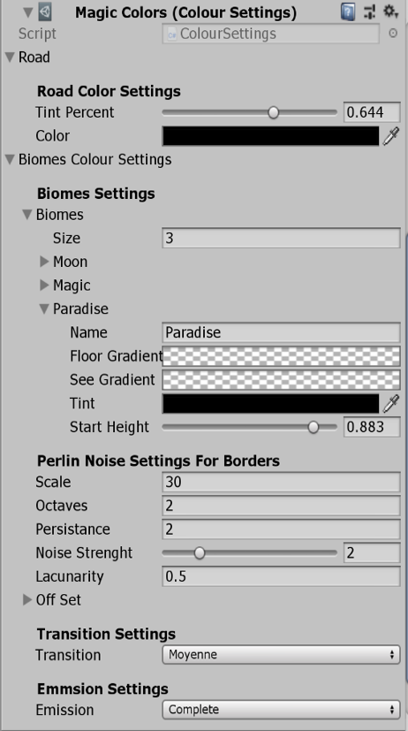
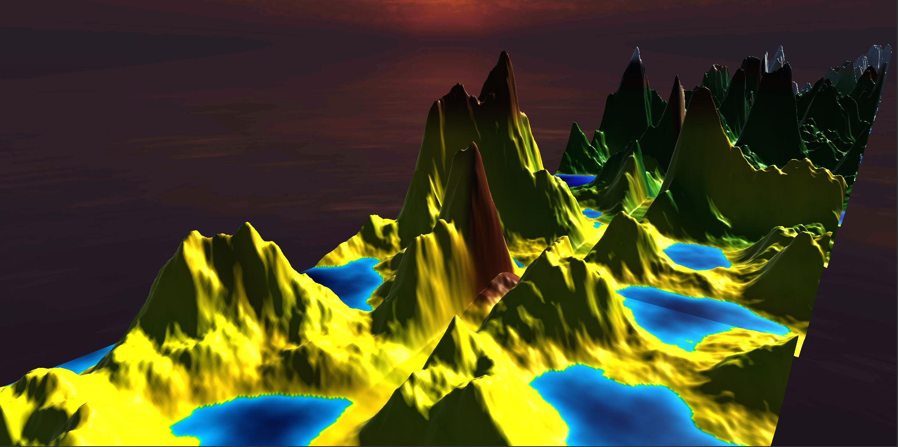
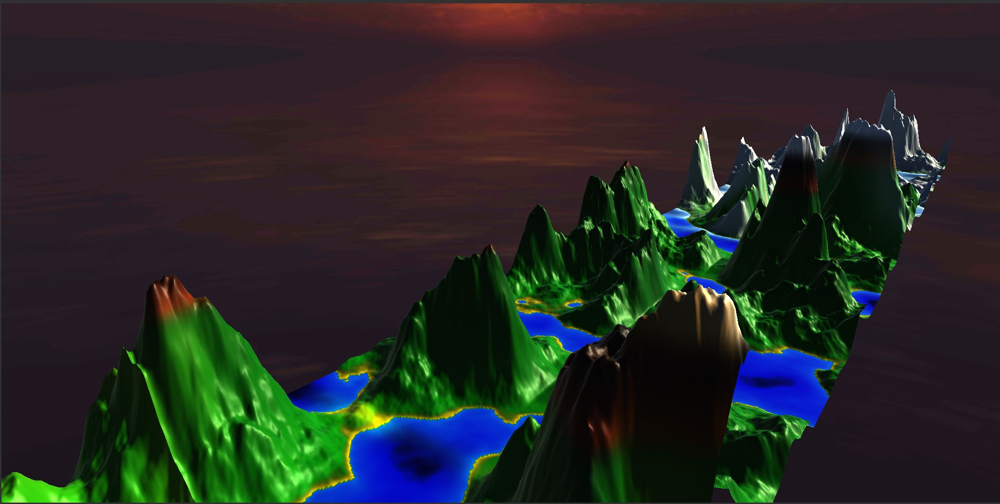
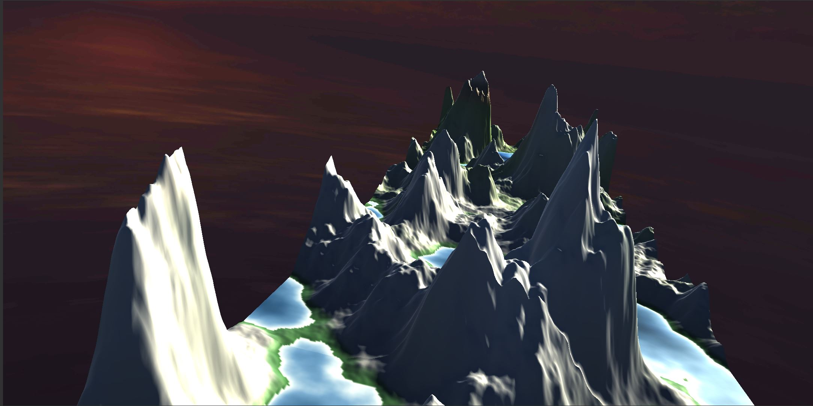
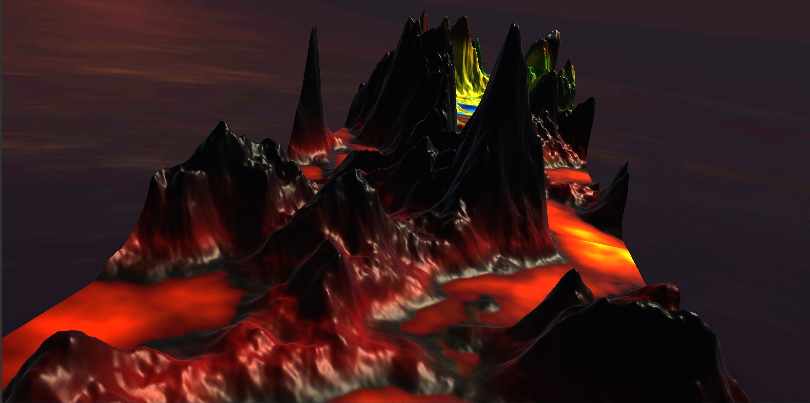
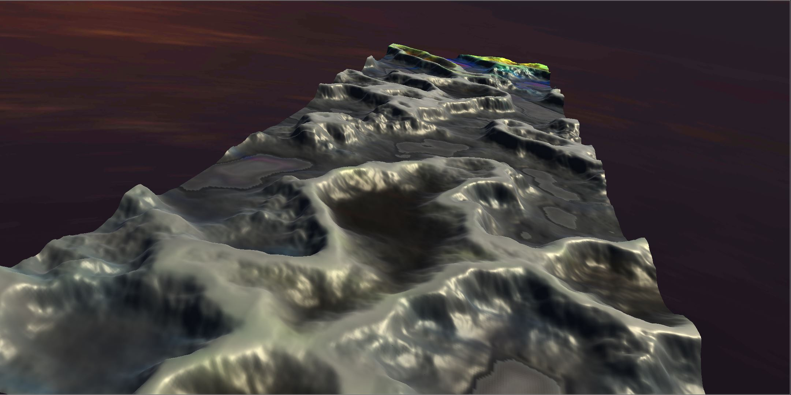

Code in private because of privacy policy. 

Procedural Generation of 3d environnement with Unity :
Structure of the code :

Example of the parameters for the shape :

Example of the parameters for the colors :

Example of a view of the 3d environnements : 

